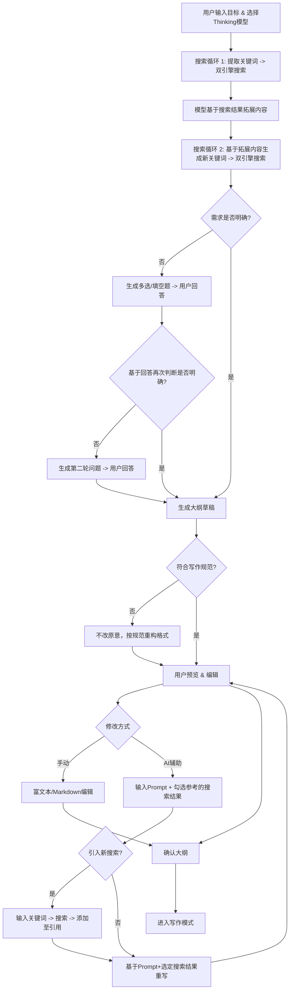

# AI智能写书助手 - 产品需求文档 (PRD)

> **文档面向对象**：VibeCoding AI 辅助开发
> **项目类型**：个人本地化 Web 应用
> **设计风格**：现代简约工业风 (Modern Industrial Minimalist)
> **核心依赖**：OpenRouter API (LLM), Bocha API (Web Search), OneBound API (WeChat Articles)
> **参考标准**：`/Users/wrf/Documents/写书/写作规范.md`

---

## 1. 项目概述 (Overview)

本项目旨在构建一个辅助个人用户进行深度书籍写作的 Web 应用。核心流程分为“智能大纲生成”与“沉浸式写作”两个阶段。系统强调逻辑闭环、多源深度搜索辅助（基于博查 API 全网搜索 + OneBound API 公众号搜索）以及严格遵循预设的写作规范。应用需支持 VibeCoding 快速开发，技术栈友好。

### 1.1 核心配置与 API (Configuration)

本项目依赖以下核心服务，开发时需正确配置环境变量或本地 Key：

| 服务 | 用途 | 接入文档 | 密钥 (Example) |
| :--- | :--- | :--- | :--- |
| **OpenRouter** | 核心 LLM 推理 (Thinking Models) | [Docs](https://openrouter.ai/docs/quickstart) | `sk-or-v1-e1adb4...` |
| **Bocha AI** | 全网深度搜索 | [Docs](https://bocha-ai.feishu.cn/wiki/HmtOw1z6vik14Fkdu5uc9VaInBb) | `sk-9860523...` |
| **OneBound** | 微信公众号文章搜索 | [Docs](https://open.onebound.cn/help/api/weixin.item_get.html) | Key: `t3041152152`<br>Secret: `21529b37` |

### 1.2 技术栈推荐 (Tech Stack)
为了对 VibeCoding 友好且适合本地运行，推荐以下技术栈：
- **Frontend Framework**: Next.js 14+ (App Router)
- **UI Library**: Tailwind CSS + Shadcn/UI (用于构建工业风组件)
- **State Management**: Zustand (处理复杂的应用状态)
- **Storage**: IndexedDB (Dexie.js) 或 SQLite (本地存储书籍内容，无需后端数据库)
- **AI Integration**: Vercel AI SDK (统一处理 OpenRouter 流式响应)
- **Markdown Rendering**: React-Markdown + Tailwind Typography

### 1.3 UI 设计风格 (Design Language)
- **风格关键词**：工业、硬朗、高对比度、单色调、极简。
- **色彩板**：
  - 背景：深灰/黑 (`#121212`)
  - 容器：枪灰色 (`#1E1E1E`)
  - 边框：细锐边框 (`#333333`)
  - 强调色：工业橙 (`#FF5722`) 或 终端绿 (`#00FF41`)
- **排版**：
  - 标题：无衬线字体 (Inter / Roboto)，大字号，粗体。
  - 正文：阅读舒适的衬线或无衬线字体。
  - 代码/数据/状态：等宽字体 (JetBrains Mono / Fira Code)。
- **交互质感**：
  - 按钮：直角或微圆角 (2px)，Hover 产生高亮边框而非阴影。
  - 加载状态：使用进度条或终端闪烁光标，避免传统的旋转圆圈。
  - 动画：快速、干脆 (Ease-out-quint, <200ms)。

---

## 2. 核心功能流程 (Core Features)

### 2.1 阶段一：智能大纲生成 (Outline Generation)

此阶段的目标是生成一份完全符合《写作规范》的结构化大纲。

#### 2.1.1 流程逻辑 (Flow Logic)



#### 2.1.2 详细功能点 (Detailed Requirements)

1.  **初始化输入**
    *   **UI**: 终端风格大输入框，模型选择下拉菜单（支持 OpenRouter 列表，特别是 Thinking 模型）。
    *   **Action**: 用户提交后，系统进入自动分析状态。

2.  **双重搜索增强 (Two-Pass Search)**
    *   **Step 1**: `User Input` -> LLM 提取关键词 -> 并行调用 `Bocha API` (全网) + `OneBound API` (公众号)。
    *   **Step 2**: `User Input` + `Search Result 1` -> LLM 拓展思路 -> 提取新关键词 -> 并行调用 `Bocha API` + `OneBound API`。
    *   **Display**: 实时显示搜索日志（如：`> Searching Web: "AI 写作 痛点"...` / `> Searching WeChat: "AI 写作 行业分析"...`），增强透明度。

3.  **智能澄清循环 (Clarification Loop)**
    *   **Input**: 用户初始输入 + 2次搜索结果。
    *   **Process**: LLM 判断信息是否足以支撑一本专业书籍的大纲。
    *   **Interaction**:
        *   若不明确，生成一系列问题（必须包含选项，支持多选，同时也支持用户文本输入补充）。
        *   **UI**: 卡片式问题列表，复选框 + 文本框。
        *   **限制**: 最多进行 2 轮问答。基于所有累积信息（输入+搜索+历史回答）进行每一轮的判断。

4.  **大纲生成与规范校验 (Generation & Validation)**
    *   **Input Context**: 用户初始输入 + 模型的判断 + 2次搜索结果 + 2轮问答历史 + **系统提示词(包含《写作规范》)**。
    *   **Validator**: 生成后，使用模型判断大纲格式是否完全符合示例。
    *   **Auto-fix**: 若不符合规范，**不改变内容**，仅按大纲编写规范进行改写。

5.  **大纲编辑器 (The Outline Editor)**
    *   **UI**: 左侧树状导航，右侧编辑器。
    *   **AI 修改功能**:
        *   用户选择模型。
        *   输入 Prompt 对大纲进行修改。
        *   **Context Selection**: 用户可**手动勾选**历史搜索结果中的哪些条目作为参考。
        *   **New Search**: 用户可输入关键词引入新的搜索内容，系统默认同时搜索全网和公众号，用户勾选新结果后，再进行修改生成。

6.  **确认与跳转**
    *   用户点击“确认大纲”后，数据锁定，自动跳转至写作页面。

---

### 2.2 阶段二：沉浸式写作 (Book Writing)

#### 2.2.1 界面布局 (UI Layout)
*   **左侧栏 (Sidebar)**: 章节导航树。
    *   状态标记：⚪ Pending, 🟡 Generating, 🟢 Completed。
    *   **交互限制**: 必须按顺序生成。只有上一章（或上一节）完成后，下一章（或下一节）才解锁。
*   **主区域 (Main)**:
    *   顶部：当前章节/小节标题及大纲摘要。
    *   操作区：
        *   **Prompt 输入框**: 用户可输入具体指令（可选）。
        *   **Model 选择**: 允许为每一章选择不同的模型。
        *   **Action**: "开始生成 / Start Generation" 按钮。
    *   编辑器：Markdown 实时流式输出区域。
*   **右侧栏 (Reference)**:
    *   显示当前引用的搜索资料。
    *   《写作规范》摘要卡片。

#### 2.2.2 生成逻辑 (Generation Logic)

1.  **触发机制 (Trigger)**
    *   用户点击某章（Chapter）。建议 UI 支持展开至“节”（Section）粒度，允许用户按“节”生成，或点击“章”进行批量生成。
    *   用户输入 Prompt（可选）+ 选择模型 -> 点击生成。

2.  **Section-Level Search & Writing (小章节粒度控制)**
    *   即便用户点击的是“生成全章”，系统内部也需按“节”进行迭代：
    *   **Step A (Search Check)**: 对于每一个“小章节”（Section），模型自动判断是否需要引入外部事实数据。
        *   *Prompt*: "Based on section title 'XXX', do we need external data?"
    *   **Step B (Auto-Search)**: 若需要，自动生成关键词 -> 调用 Bocha API (Web) + OneBound API (WeChat) -> 聚合结果。
    *   **Step C (Generation)**:
        *   **Input**:
            1.  《写作规范.md》（System Prompt）。
            2.  当前章节大纲。
            3.  **用户 Prompt**（如果有）。
            4.  **搜索结果**（如果有）。
            5.  **前文上下文**（Previous Context）：**必须**包含之前生成的所有章节内容，以保证连贯性。
        *   **Output**: 生成该小节的 Markdown 内容。

3.  **上下文管理 (Context Management)**
    *   鉴于书籍可能很长，需实现“关键上下文”机制：
    *   **Recent History**: 最近 N 章的完整文本。
    *   **Global Summary**: 较远章节的摘要（或依赖长 Context 模型直接透传全文，视 token 限制而定）。
    *   **Prompt 注入**: 始终在 System Prompt 中强调“承上启下”，引用前文观点。

4.  **规范执行**
    *   严格遵循《写作规范》中的图表编号（图 x-y）、模块类型（理论/方法/实战/前沿）写作要求。

---

## 3. 交互跳转逻辑 (Interaction Logic)

### 3.1 页面路由
- `/`: 首页/Dashboard (新建书籍或继续)
- `/wizard`: 大纲生成向导 (Step-by-step)
- `/editor/[book_id]`: 核心写作界面

### 3.2 状态流转
1.  **Init**: 用户输入 -> `/wizard`
2.  **Wizard Loop**: Search -> QA -> Search -> QA -> Outline Preview
3.  **Refinement**: Outline Edit (Manual/AI) -> Confirm -> Redirect to `/editor`
4.  **Writing**:
    - Select Chapter 1 -> Generate -> Review/Edit -> Lock
    - Unlock Chapter 2 -> Select -> Generate...
    - (Loop until Finish)
5.  **Export**: 导出完整 Markdown/PDF。

---

## 4. 提示词工程策略 (Prompt Engineering)

### 4.1 关键词提取 (System Prompt)
```text
你是一个专业的书籍策划专家。请分析用户的写作目标，提取3-5个核心搜索关键词，用于在搜索引擎（全网 + 公众号文章）中寻找相关的市场现状、痛点、案例或理论支持。
输出格式：JSON数组 ["keyword1", "keyword2", ...]
```

### 4.2 需求澄清提问 (System Prompt)
```text
你是一个严谨的图书编辑。基于用户目标和搜索结果，判断当前信息是否足以构建一份深度的大纲。
如果不足，请提出3-5个关键问题来明确书籍的受众、核心差异化价值或具体风格。
要求：
1. 问题要有针对性。
2. 每个问题必须提供3-4个建议选项（供用户多选）。
3. 允许用户补充回答。
输出格式：JSON对象 { "sufficient": boolean, "questions": [{ "text": string, "options": string[] }] }
```

### 4.3 大纲生成 (System Prompt)
```text
你是一个资深图书出版人。请根据以下所有信息生成一份深度专著大纲。

【输入信息】：
1. 用户核心目标: {{user_goal}}
2. 累积搜索资料: {{search_data_summary}}
3. 用户问答记录: {{qa_history}}

【必须严格遵守的写作规范】：
{{writing_standards_content}} (此处注入写作规范.md全文)

【要求】：
- 严格采用“篇-章-节”三级架构。
- 每一节必须标注其类型（理论型/方法型/实战型/前沿型）。
- 每一章必须包含“章引言”和“本章小结”。
- 确保逻辑闭环，拒绝简单的知识点堆砌。
```

### 4.4 写作内容生成 (System Prompt)
```text
你是一个专业作家。正在编写《{{book_title}}》的：
第 {{part_index}} 篇 - 第 {{chapter_index}} 章 - 第 {{section_index}} 节：{{section_title}}

【写作规范】：
{{writing_standards_content}}

【前文脉络（用于保持连贯性）】：
{{previous_context}}

【本节参考资料】：
{{search_results}}

【用户指令】：
{{user_prompt}}

【任务】：
请撰写本节内容。
1. 风格：专业、干货、现代工业风。
2. 结构：严格按照《写作规范》中定义的“{{section_type}}”类型的模板进行写作。
3. 引用：如果使用了参考资料，请自然融入，不要生硬堆砌。
4. 篇幅：适中，确保把问题讲透。
```

---

## 5. 数据结构定义 (Data Schemas)

```typescript
// 书籍大纲结构
interface BookOutline {
  title: string;
  target_audience: string;
  core_goal: string;
  parts: BookPart[]; // 篇
}

interface BookPart {
  id: string;
  title: string; // 篇标题
  intro: string; // 篇首语
  chapters: BookChapter[];
}

interface BookChapter {
  id: string;
  title: string;
  intro: string; // 章引言
  summary: string; // 本章小结
  sections: BookSection[]; // 节
  status: 'locked' | 'pending' | 'generating' | 'completed';
}

interface BookSection {
  id: string;
  title: string;
  type: 'theory' | 'method' | 'practice' | 'trend'; // 对应规范中的 A/B/C/D 类型
  key_points: string[];
  content?: string; // 生成的正文
  search_keywords?: string[]; // 自动生成的搜索词
  search_references?: SearchResult[]; // 实际引用的搜索结果
}

// 搜索结果
interface SearchResult {
  title: string;
  url: string;
  snippet: string;
  source: 'web' | 'wechat'; // 区分来源：全网 or 公众号
  publish_date?: string;
}

// 用户交互状态
interface WizardState {
  step: 'input' | 'search_1' | 'expand' | 'search_2' | 'clarify' | 'outline' | 'review';
  clarification_round: number; // 0, 1, 2
  history: {
    user_input: string;
    search_contexts: SearchContext[]; // 包含 query 和 results
    qa_pairs: { question: string; options: string[]; answer: string[] | string }[]; // 支持多选
  };
}

---

## 6. 开发计划 (Development Plan)

1.  **Setup**: 初始化 Next.js 项目，配置 Tailwind 及 Shadcn/UI，设置 API 代理 (OpenRouter/Bocha/OneBound)。
2.  **Core Logic (Hook)**: 实现 `useBookGenerator` Hook，封装状态机和 API 调用链（支持双源搜索聚合）。
```
